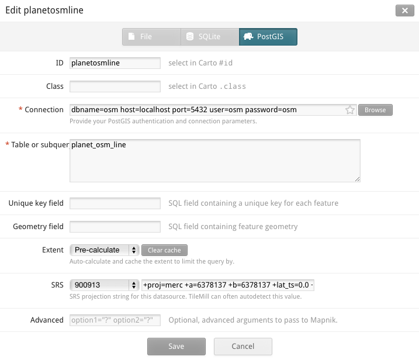

# Everything is OSM

Get started with PostGIS + OpenStreetMap data in minutes. Works on Windows,
Linux, and Mac. [More free time for your OSM
community!](https://www.youtube.com/watch?v=StTqXEQ2l-Y&t=5s)

This project uses popular [development](http://vagrantup.com/) and [system
configuration](http://docs.ansible.com/) tools to build and configure a [virtual
machine](https://www.virtualbox.org/), then download and import OpenStreetMap
data extracts from [mapzen](https://mapzen.com/metro-extracts/) and
[geofabrik](http://download.geofabrik.de/).

## Quickstart

### Requirements

First, install recent versions of these:

- [Vagrant](http://vagrantup.com/)
- [Virtualbox](https://www.virtualbox.org/)

### Choose your extracts

The [metro extracts](https://mapzen.com/metro-extracts/) are focused on major
metropolitan areas, and the [geofabrik extracts](http://download.geofabrik.de/)
contain data that span countries and international regions. Larger volumes of
data will take longer may require more virtual machine memory to successfully
import; see the section on [customizing](#customizing) for instructions on how
to increase the amount of RAM.

Edit `variables.yml` so it contains the extracts that you want to include. For
example:

    metro_extracts:
      - "austin"
      - "barcelona"
      - "portland"

or:

    geofabrik_extracts:
      - "south-america/ecuador"
      - "south-america/peru"

### Get the party started

From the command line, just run `vagrant up` and give it a few minutes to do it
does its thing. When it finishes running, a PostGIS database will be ready to go
and loaded up with OSM data!

### Everything is OSM

The PostGIS database will be available on localhost. For example, to connect to
the database from Tilemill:

    dbname=osm host=localhost port=5432 user=osm password=osm

## Additional usage

### Customizing

The file `variables.yml` contains the database name, user and password (all
default to "osm"), as well as port number (default 5432), and settings for
virtual machine memory and number of cpus. Feel free to open up `variables.yml`
and change any of these values. You will need to reload the virtual machine
for settings to take effect.

### Reloading

To reload the virtual machine, run `vagrant reload`.

### Stopping

When you need to stop the virtual machine, run `vagrant halt`.

