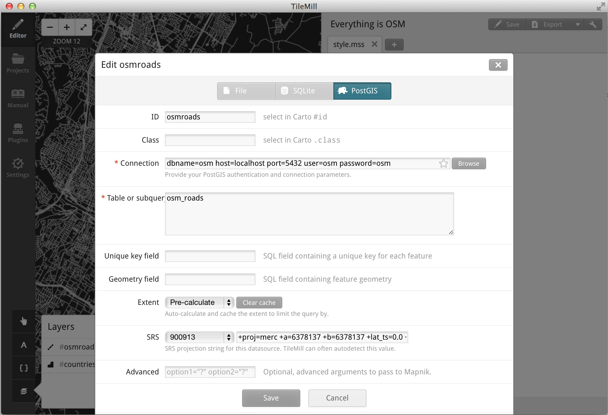
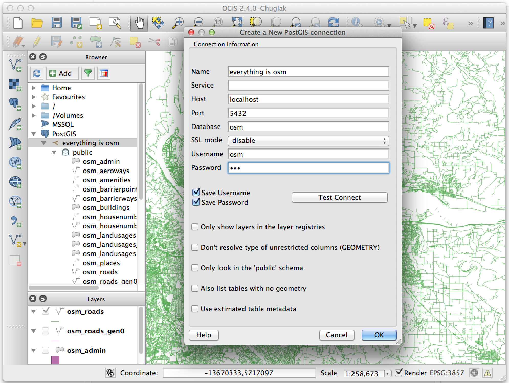

# Everything is OSM

Get started with PostGIS + OpenStreetMap data in minutes. Works on Windows,
Linux, and Mac. [More free time for your OSM
community!](https://www.youtube.com/watch?v=StTqXEQ2l-Y&t=5s)

This project uses popular [development](http://vagrantup.com/) and [system
configuration](http://docs.ansible.com/) tools to build and configure a [virtual
machine](https://www.virtualbox.org/), then download and import OpenStreetMap
data extracts from [mapzen](https://mapzen.com/metro-extracts/) and
[geofabrik](http://download.geofabrik.de/).

## Quickstart

### Requirements

First, install recent versions of these:

- [Vagrant](http://vagrantup.com/)
- [Virtualbox](https://www.virtualbox.org/)

### Choose your extracts

Decide what part of the world you want to import data for. The [metro
extracts](https://mapzen.com/metro-extracts/) cover major metropolitan areas,
and the [geofabrik extracts](http://download.geofabrik.de/) cover countries and
international regions.

**Note**: Larger volumes of data will take more time and might require more
virtual machine memory to successfully import; see the section on
[customizing](#customizing) for instructions on how to increase the amount of
RAM if that's happening to you. Also, extremely large amounts of data (larger
than a few GB) are not currently supported.

Edit `variables.yml` so it contains the extracts that you want to include. For
example:

    metro_extracts:
      - "austin"
      - "barcelona"
      - "portland"

or:

    geofabrik_extracts:
      - "south-america/ecuador"
      - "south-america/peru"

### Get the party started

From the command line, just run `vagrant up` and give it a few minutes to do it
does its thing. When it finishes running, a PostGIS database will be ready to go
and loaded up with OSM data!

### Everything is OSM

The PostGIS database will be available on localhost. For example, to connect to
the database from Tilemill:

    dbname=osm host=localhost port=5432 user=osm password=osm

Or from QGIS:

## Additional Usage

### Customizing

The file `variables.yml` contains the database name, user and password (all
default to "osm"), as well as port number (default 5432), and settings for
virtual machine memory and number of cpus. Feel free to open up `variables.yml`
and change any of these values. You will need to [reload](#advanced-vagrant) the
virtual machine for settings to take effect.

### Vagrant Basics

This project uses [vagrant](http://vagrantup.com/) to manage the virtual
machine. Vagrant provides a pretty simple interface. These are the most relevant
commands:

`vagrant up` starts up the virtual machine and runs through the configuration
and import scripts.

`vagrant halt` stops the virtual machine. This releases any RAM you've dedicated
to the virtual machine. After this, the PostGIS database will not be available
until `vagrant up` is run again.

### Advanced Vagrant

`vagrant reload` restarts the virtual machine. It is equivalent to `vagrant
halt` then `vagrant up`.

`vagrant up --no-provision` will skip the import phase. This will save time if
data extracts have previously been imported and the virtual machine was stopped
with `vagrant halt`.

`vagrant destroy` will completely wipe out the virtual machine. All the files
and data on the virtual machine will be removed, including anything in the
database.  It is useful if you want to reclaim disk space or just start over
from scratch.

`vagrant provision` will just run through the setup and import phase without
stopping the virtual machine. This can be slightly faster than a `vagrant
reload` if add new extracts have been added to `variables.yml` and those need to
be imported.
